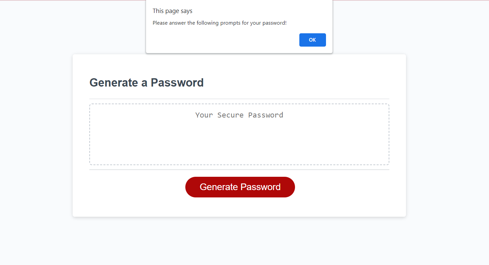

# Unique-Passwords

## Description
I have created a password randomizer. It creates a new unique password when a user inputs what they want in specific in their password. From how long the password should be to what it should be included. It could include Upper/Lower case letters, Numbers or Characters.

[Go to Website here]()

## Installation
I created a new repository in GitHub and then cloned it to my computer. Then I was able to copy the file "Develop" to my repo and then edit and fill in the Java file. 

## Usage
It provides an easier way to create a password. It is a safe, strong way to keep your accounts safe without any hard thoughts.

## Credits
The University of Toronto,
Ariana Vinamagua